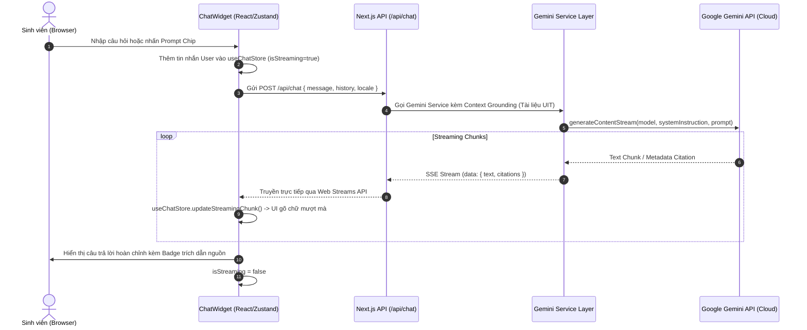

# 🏛️ UIT Student Assistant - Project Structure & Architecture Specification

> **Dự án**: Trợ lý ảo AI & Dashboard Sinh viên UIT (Đại học Công nghệ Thông tin - ĐHQG TP.HCM)  
> **Công nghệ**: Next.js 16 (App Router) + React 19 + TypeScript + Zustand + next-intl + @google/genai  
> **Mục tiêu**: Chuẩn hóa cấu trúc thư mục dạng **Clean Modular Architecture**, tích hợp Gemini Long Context Grounding, Streaming SSE, Bento Grid Dashboard và Đa ngôn ngữ (vi/en).

---

## 1. 📂 Sơ Đồ Cây Thư Mục Tổng Thể (Standard Project Tree)

```text
uit_assistance/
├── .env.example                     # Biến môi trường mẫu (GEMINI_API_KEY, APP_URL, ...)
├── .env.local                       # Biến môi trường local (chứa API Key bí mật)
├── .gitignore                       # Git ignore tiêu chuẩn cho Next.js / Node
├── next.config.ts                   # Next.js 16 configuration + next-intl plugin
├── package.json                     # Quản lý dependencies & npm scripts
├── pnpm-lock.yaml                   # Lockfile pnpm
├── pnpm-workspace.yaml              # Cấu hình workspace & build approval
├── tsconfig.json                    # Cấu hình TypeScript compiler & Path Aliases (@/*)
│
├── messages/                        # 🌐 Từ điển đa ngôn ngữ (i18n Dictionary)
│   ├── vi.json                      # Bản dịch Tiếng Việt (Default locale)
│   └── en.json                      # Bản dịch Tiếng Anh
│
├── knowledge_base/                  # 📚 Dữ liệu tri thức UIT (Context Grounding)
│   ├── raw_documents/               # Lưu file PDF gốc (VD: 01 - Tong quan 2025-posted.pdf)
│   ├── processed/                   # Dữ liệu trích xuất dạng Markdown / JSON có đánh chỉ mục
│   └── uit_rules_handbook.json      # Quy chế học vụ, thang điểm, điều kiện tốt nghiệp UIT
│
├── public/                          # 🖼️ Static assets (Public CDN/Files)
│   ├── fonts/                       # Custom typography (Inter, Outfit, Be Vietnam Pro)
│   ├── images/                      # Logo UIT, favicon, illustrations
│   └── icons/                       # Favicon & app icons
│
└── src/                             # 🚀 Mã nguồn chính của ứng dụng
    ├── middleware.ts                # Middleware định tuyến i18n của next-intl
    │
    ├── app/                         # 📁 App Router (Next.js 16)
    │   ├── [locale]/                # Phân vùng Dynamic Route theo ngôn ngữ (/vi, /en)
    │   │   ├── layout.tsx           # Root Layout (Fonts, NextIntlClientProvider, Theme)
    │   │   ├── page.tsx             # Trang chính: 1-Page Bento Dashboard + Chat Widget
    │   │   ├── error.tsx            # Xử lý lỗi toàn cục phía client
    │   │   ├── loading.tsx          # Skeleton loading khi SSR trang chủ
    │   │   └── not-found.tsx        # Trang 404 tùy chỉnh
    │   │
    │   └── api/                     # ⚡ Backend API Route Handlers (Controller)
    │       ├── chat/
    │       │   └── route.ts         # POST /api/chat: Xử lý câu hỏi, gọi Gemini, SSE Streaming
    │       ├── context/
    │       │   └── route.ts         # GET /api/context: Truy vấn dữ liệu tri thức / Metadata PDF
    │       └── health/
    │           └── route.ts         # GET /api/health: Health check status
    │
    ├── components/                  # 🧩 Reusable UI Components
    │   ├── bento/                   # [Trụ cột 3] Các Widget thuộc Bento Grid Dashboard
    │   │   ├── BentoGrid.tsx        # Khung bố cục Bento Grid responsive
    │   │   ├── StudentProfileCard.tsx # Thẻ thông tin sinh viên, MSSV, khoa
    │   │   ├── ScheduleCard.tsx     # Lịch học trong ngày / tuần
    │   │   ├── GpaTrackerCard.tsx   # Biểu đồ tiến độ học tập & điểm GPA / ĐRL
    │   │   ├── QuickActionsCard.tsx # Lối tắt: Đăng ký môn, Đăng ký giấy tờ, Tra cứu phòng
    │   │   ├── DeadlinesCard.tsx    # Deadline bài tập & lịch nộp đồ án
    │   │   └── NewsFeedCard.tsx     # Thông báo nóng từ phòng Đào tạo UIT
    │   │
    │   ├── chat/                    # [Trụ cột 3] Giao diện Trợ lý AI Chat
    │   │   ├── ChatDrawer.tsx       # Khung Chat Drawer trượt mượt mà (Floating Panel)
    │   │   ├── ChatHeader.tsx       # Header Chat (chuyển model, nút clear, đóng/mở)
    │   │   ├── ChatMessageList.tsx  # Danh sách bong bóng tin nhắn (User & AI)
    │   │   ├── ChatMessageItem.tsx  # Từng tin nhắn (Markdown rendering + Citations)
    │   │   ├── ChatInput.tsx        # Ô nhập câu hỏi + nút Gửi + Voice/File đính kèm
    │   │   ├── PromptChips.tsx      # Gợi ý câu hỏi thông minh nhanh (One-click prompt)
    │   │   ├── CitationBadge.tsx    # Badge trích dẫn số trang / slide tài liệu UIT
    │   │   └── MarkdownRenderer.tsx # Hiển thị cú pháp Markdown, Code Highlight, Table
    │   │
    │   ├── common/                  # Các component dùng chung toàn app
    │   │   ├── Header.tsx           # Top Navbar (Logo, Thông báo, i18n Switcher, Profile)
    │   │   ├── LanguageSwitcher.tsx # Dropdown chuyển đổi ngôn ngữ Việt / Anh
    │   │   ├── ThemeToggle.tsx      # Dark / Light Mode switcher
    │   │   └── Footer.tsx           # Footer bản quyền UIT Assistant
    │   │
    │   └── ui/                      # Base Atomic UI Components (Design System)
    │       ├── Button.tsx
    │       ├── Card.tsx
    │       ├── Badge.tsx
    │       ├── Tooltip.tsx
    │       ├── Skeleton.tsx
    │       └── Modal.tsx
    │
    ├── i18n/                        # 🌐 Cấu hình Next-Intl
    │   ├── routing.ts               # Định nghĩa danh sách ngôn ngữ (vi, en) & default locale
    │   ├── request.ts               # getRequestConfig nạp file messages tương ứng
    │   └── navigation.ts            # Hook điều hướng có hỗ trợ locale (Link, useRouter, ...)
    │
    ├── lib/                         # ⚙️ Thư viện tích hợp, SDK & Services
    │   ├── gemini/                  # [Trụ cột 1] Tích hợp Google GenAI SDK (@google/genai)
    │   │   ├── client.ts            # Khởi tạo Gemini client instance an toàn
    │   │   ├── prompts.ts           # System Prompts chuẩn hóa (Personality, Grounding rules)
    │   │   ├── stream.ts            # Helper tạo ReadableStream / SSE Stream chuyển tiếp
    │   │   └── context-loader.ts    # Đọc & cache tài liệu PDF/Text đưa vào System Context
    │   │
    │   ├── knowledge/               # [Trụ cột 1] Quản lý & Parser tài liệu UIT
    │   │   ├── pdf-extractor.ts     # Trích xuất nội dung từ slide PDF (kèm Page Number)
    │   │   └── handbook-service.ts  # Tìm kiếm quy chế / môn học theo từ khóa
    │   │
    │   └── utils/                   # Hàm tiện ích chung
    │       ├── cn.ts                # Merge classNames (clsx)
    │       ├── cookie.ts            # Đọc / ghi cookie phía client (js-cookie)
    │       └── formatters.ts        # Format ngày giờ, định dạng điểm số
    │
    ├── store/                       # 🧠 [Trụ cột 2] Quản lý State toàn cục (Zustand)
    │   ├── useChatStore.ts          # State cho Chat: messages, isLoading, isStreaming, drawerOpen
    │   └── useDashboardStore.ts     # State cho Dashboard: selectedSemester, filter, studentInfo
    │
    ├── styles/                      # 🎨 Hệ thống Style & Theme
    │   ├── globals.css              # Reset CSS, Biến màu HSL (Dark/Light), Typography
    │   ├── bento.css                # CSS Grid layout, Glassmorphism, Glow effects
    │   ├── chat.css                 # CSS Chat bubble, Streaming cursor animation
    │   └── markdown.css             # Style bảng biểu, code block trong nội dung chat AI
    │
    └── types/                       # 🏷️ TypeScript Type Definitions & Interfaces
        ├── chat.ts                  # Message, Citation, StreamChunk, ChatRole
        ├── dashboard.ts             # Student, ScheduleItem, GpaHistory, QuickAction
        ├── knowledge.ts             # PDFDocument, PageSegment, RuleItem
        └── api.ts                   # ChatRequest, ChatResponse, ErrorResponse
```

---

## 2. 🔍 Chi Tiết 4 Trụ Cột Triển Khai (Mapping Với Cấu Trúc Thư Mục)

### 🌟 Trụ cột 1: Backend & Service Layer (`src/app/api/chat` + `src/lib/gemini`)
- **`src/lib/gemini/client.ts`**: Khởi tạo SDK `@google/genai` với `apiKey: process.env.GEMINI_API_KEY`.
- **`src/lib/gemini/context-loader.ts`**: Tận dụng Context Window 1M+ tokens của Gemini 2.5/2.0 để load toàn bộ tri thức (quy chế, slide bài giảng `01 - Tong quan 2025-posted.pdf`) vào `systemInstruction`.
- **`src/app/api/chat/route.ts`**: Next.js App Router Route Handler nhận câu hỏi từ frontend, kích hoạt `ai.models.generateContentStream`, đóng gói chunks thành dòng SSE (Server-Sent Events) truyền trực tiếp về client.
- **`src/lib/knowledge/pdf-extractor.ts`**: Xử lý dữ liệu văn bản từ slide bài giảng kèm metadata số trang để Gemini có thể trích dẫn nguồn (Citations).

### 🧠 Trụ cột 2: Store & State Management (`src/store/`)
- **`src/store/useChatStore.ts`**:
  - `messages`: Danh sách tin nhắn dạng streaming.
  - `isStreaming`: Boolean xác định khi nào AI đang gõ chữ.
  - `isDrawerOpen`: Trạng thái bật/tắt cửa sổ Chatbot.
  - `addMessage`, `updateStreamingChunk`, `clearHistory`.
- **`src/store/useDashboardStore.ts`**:
  - Lưu trạng thái xem học kỳ, widget yêu thích, filter thông báo.

### 🎨 Trụ cột 3: Giao diện Bento Dashboard & Chat Widget (`src/components/`)
- **`src/components/bento/`**: Cấu trúc các ô Bento hiện đại (Glassmorphism, viền sáng Gradient, Card bo tròn) hiển thị tổng quan thông tin học tập của sinh viên UIT.
- **`src/components/chat/`**:
  - `ChatDrawer.tsx`: Cửa sổ nổi bên góc phải màn hình, có thể thu gọn hoặc mở rộng toàn màn hình.
  - `PromptChips.tsx`: Các chip câu hỏi gợi ý nhanh (VD: *"Điều kiện miễn anh văn đầu ra?", "Cách tính điểm rèn luyện?", "Lịch thi lại môn IT001?"*).
  - `MarkdownRenderer.tsx`: Hỗ trợ render Markdown đẹp mắt, có nút copy code, bảng biểu sinh động.

### 🌐 Trụ cột 4: Đa ngôn ngữ (i18n) & Code Quality (`src/i18n/` + `messages/`)
- **`messages/vi.json` & `messages/en.json`**: Từ điển đầy đủ cho toàn bộ giao diện Dashboard và Chatbot.
- **`src/middleware.ts`**: Tự động nhận diện `Accept-Language` hoặc Cookie để chuyển hướng người dùng đến đúng `/vi` hoặc `/en`.
- **Đồng bộ Key**: Cấu trúc key JSON nhất quán 100% giữa các ngôn ngữ.

---

## 3. 🔄 Luồng Dữ Liệu Chi Tiết (Data Flow & Streaming Architecture)



---

## 4. ⚙️ Thiết Lập Mẫu Cốt Lõi (Core Configurations)

### 4.1. `tsconfig.json` (Path Aliases `@/*`)
```json
{
  "compilerOptions": {
    "target": "ES2022",
    "lib": ["dom", "dom.iterable", "esnext"],
    "allowJs": true,
    "skipLibCheck": true,
    "strict": true,
    "noEmit": true,
    "esModuleInterop": true,
    "module": "esnext",
    "moduleResolution": "bundler",
    "resolveJsonModule": true,
    "isolatedModules": true,
    "jsx": "preserve",
    "incremental": true,
    "plugins": [
      {
        "name": "next"
      }
    ],
    "paths": {
      "@/*": ["./src/*"],
      "@messages/*": ["./messages/*"]
    }
  },
  "include": ["next-env.d.ts", "**/*.ts", "**/*.tsx", ".next/types/**/*.ts"],
  "exclude": ["node_modules"]
}
```

### 4.2. `next.config.ts` (Tích hợp `next-intl`)
```typescript
import type { NextConfig } from 'next';
import createNextIntlPlugin from 'next-intl/plugin';

const withNextIntl = createNextIntlPlugin('./src/i18n/request.ts');

const nextConfig: NextConfig = {
  reactStrictMode: true,
  // Cho phép xử lý PDF hoặc file static nếu cần
};

export default withNextIntl(nextConfig);
```

### 4.3. `.env.example`
```env
# Google Gemini AI
GEMINI_API_KEY=your_gemini_api_key_here
GEMINI_MODEL=gemini-2.5-flash

# Application
NEXT_PUBLIC_APP_NAME="UIT Student Assistant"
NEXT_PUBLIC_DEFAULT_LOCALE="vi"
```

---

## 5. 🚀 Kế Hoạch Triển Khai Tiếp Theo (Next Implementation Steps)

1. **Bước 1: Khởi tạo Configs & Cấu trúc thư mục**
   - Tạo các file cấu hình `tsconfig.json`, `next.config.ts`, `.env.example`, `.env.local`.
   - Tạo toàn bộ cây thư mục `src/`, `messages/`, `knowledge_base/`.
2. **Bước 2: Cài đặt hệ thống Đa ngôn ngữ (i18n)**
   - Thiết lập `src/i18n/routing.ts`, `src/i18n/request.ts`, `src/middleware.ts`.
   - Viết các key bản dịch mẫu trong `messages/vi.json` và `messages/en.json`.
3. **Bước 3: Xây dựng Backend Gemini Service & Streaming API**
   - Viết `src/lib/gemini/client.ts` và `src/lib/gemini/prompts.ts`.
   - Viết API Route `src/app/api/chat/route.ts` với hỗ trợ Server-Sent Events (SSE).
4. **Bước 4: Xây dựng Zustand Stores & Giao diện Bento Dashboard + Chat**
   - Thiết lập `useChatStore.ts` & `useDashboardStore.ts`.
   - Triển khai Bento Grid Dashboard và Chat Drawer với hiệu ứng gõ chữ mượt mà.
